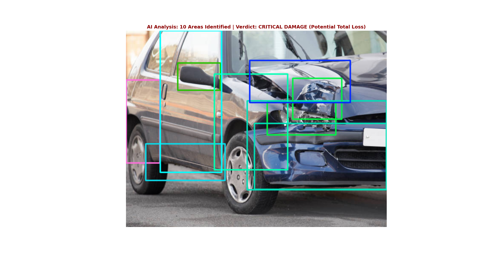

# 👁️ Automated Car Damage Assessment (Computer Vision)


## 📋 Executive Summary
This project automates the vehicle insurance claims process using **Computer Vision**. 
Leveraging the state-of-the-art **YOLOv8** architecture, the model detects vehicle body damages (dents, scratches, smashes) from images and estimates severity in real-time.

This "AI Adjuster" aims to reduce claim processing time from days to seconds, enabling **Straight-Through Processing (STP)** for minor incidents and flagging total losses instantly.

---

## 🏗️ Technical Architecture (Hybrid Cloud)

The workflow demonstrates a modern ML Operations (MLOps) approach:

1.  **Training (Cloud):** The model was trained on **Google Colab (T4 GPU)** using a labeled dataset of crashed vehicles.
2.  **Transfer Learning:** Utilized the pre-trained YOLOv8 weights to accelerate convergence on the "Car Damage" class.
3.  **Inference (Edge/Local):** The trained weights (`best.pt`) were deployed to a local Python microservice (`app.py`) using **Ultralytics** and **OpenCV** for real-time detection on standard hardware.

---

## 🧠 Model Performance

* **Model Architecture:** YOLOv8 (You Only Look Once) - Nano/Small.
* **Task:** Object Detection (Bounding Box Regression).
* **Classes Detected:** Vehicle Damages (Dent, Scratch, Smash).
* **Inference Speed:** ~200ms per image (CPU).

---

## 🚀 How to Run

### 1. Environment Setup
Install the required computer vision libraries:
    ```bash
pip install ultralytics opencv-python matplotlib

### 2. Deployment
Ensure the trained model weights (best.pt) are in the root directory. Then, run the inference script on a test image:
    ```bash
python app.py

### 3. Output
The system renders the analyzed image with bounding boxes and a severity verdict (e.g., "CRITICAL DAMAGE"):



## 📂 Project Structure
    ```Plaintext
    17_ComputerVision_AutoInsurance/
    ├── app.py           # Inference Engine (Local Deployment)
    ├── best.pt          # Trained Model Weights (from Cloud)
    ├── test_car.jpg     # Sample Image
    └── README.md        # Documentation

## 👨‍💻 Author
Glauber Rocha Senior Data Professional | AI & Engineering