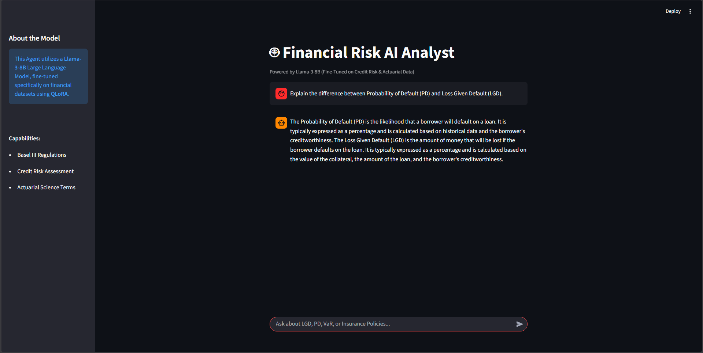

# 🤖 Financial Risk Analyst (Llama-3 Fine-Tune)

## 📋 Executive Summary
This project demonstrates the **fine-tuning of a Large Language Model (LLM)** to create a specialized AI agent for the Financial Sector.
By training **Llama-3-8B** on a dataset of 50k+ financial instructions (Credit Risk, Actuarial Science, and Regulatory Compliance), the model transitioned from a generic assistant to a **Domain Expert**.

The final model is quantized (GGUF), containerized via **Docker**, and deployed locally using a Python Streamlit interface. This architecture ensures **Data Privacy** (100% offline/air-gapped) and **Reproducibility** across any environment.

---

## 🏗️ Technical Architecture

1.  **Training (Cloud GPU):**
    * **Infrastructure:** Google Colab (T4 GPU).
    * **Technique:** **QLoRA** (Quantized Low-Rank Adaptation) via **Unsloth** library (2x faster training, 60% less memory).
    * **Dataset:** `gbharti/finance-alpaca` (Financial Q&A pairs).

2.  **Quantization:**
    * Converted the fine-tuned weights to **GGUF (q4_k_m)** format to run efficiently on standard consumer CPUs/GPUs.

3.  **Deployment (MLOps):**
    * **Containerization:** Docker (Linux-based Python 3.12 image).
    * **Engine:** `llama.cpp` (via `llama-cpp-python`).
    * **Interface:** Streamlit (Chat UI).

---

## 🧠 Model Capabilities (Before vs. After)

| Feature | Base Model (Generic) | Fine-Tuned Finance Model |
| :--- | :--- | :--- |
| **Vocabulary** | General English | Specialized (Basel III, LGD, VaR) |
| **Tone** | Conversational / Chatty | Professional / Analyst-like |
| **Data Privacy** | SaaS (Cloud) | **100% Local / Air-gapped** |

---

## 🚀 How to Run

You can run this project either using **Docker** (Recommended) or a manual Python installation.

### 🐳 Option 1: Docker (Recommended)
Ensures the app runs perfectly on any OS without dependency conflicts.

**1. Build the Image**
    
    docker build -t finance-llm-app:v1 .

**2. Run the Container**
    
    docker run -p 8501:8501 finance-llm-app:v1

Access the application at: http://localhost:8501

### 🐍 Option 2: Manual Python Setup
Note: Requires Python 3.11 or 3.12 (Python 3.13 is not yet supported by llama-cpp).

**1. Install Dependencies**
    
    pip install streamlit
    # Install pre-compiled wheel for CPU (Windows)
    pip install llama-cpp-python==0.2.90 --extra-index-url [https://abetlen.github.io/llama-cpp-python/whl/cpu](https://abetlen.github.io/llama-cpp-python/whl/cpu) --prefer-binary

**2. Run the App** Ensure the model file (finance_model_llama3.gguf) is in the root directory.
    
    streamlit run app.py

## Demo
The agent explains "Probability of Default vs Loss Given Default":

## 📂 Project Structure
    
    18_Finance_LLM_FineTuning/
    ├── Dockerfile               # MLOps: Container configuration
    ├── app.py                   # Streamlit Chat Interface
    ├── finance_model_llama3.gguf # The "Brain" (GitIgnored due to size)
    ├── requirements.txt         # Dependencies
    └── README.md                # Documentation

## 👨‍💻 Author
Glauber Rocha Senior Data Professional | AI Engineering