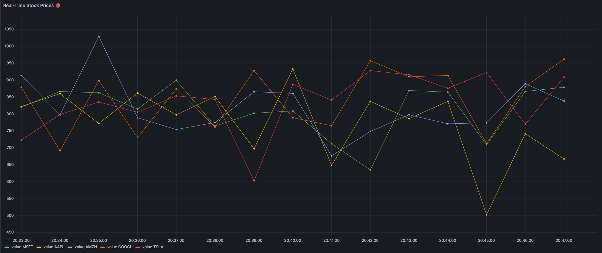

# 📈 Real-Time Stock Market Analysis with Spark & Kafka

## 📋 Project Overview
This project implements a scalable **Big Data pipeline** for real-time stock market analysis. It simulates a High-Frequency Trading (HFT) environment where stock data is generated, streamed, processed, and visualized with low latency.

## 🛠️ Tech Stack
* **Source:** Python (Simulated Stock Producer)
* **Ingestion:** Apache Kafka & Zookeeper
* **Processing:** Apache Spark (Structured Streaming)
* **Storage:** PostgreSQL
* **Visualization:** Grafana
* **Infrastructure:** Docker & Docker Compose

## 🏗️ Architecture
1.  **Producer:** Python script generates synthetic stock data (AAPL, GOOGL, AMZN, MSFT, TSLA).
2.  **Broker:** Kafka handles the stream ingestion.
3.  **Processor:** Spark reads from Kafka, performs aggregations (Window functions), and writes to DB.
4.  **Dashboard:** Grafana visualizes trends, moving averages, and volatility in real-time.

## 🚀 How to Run

### Prerequisites
* Docker & Docker Compose
* Python 3.9+

### Steps
1.  Clone the repository.
2.  Start the infrastructure:
    ```bash
    docker-compose up -d
    ```
3.  Install dependencies:
    ```bash
    pip install -r requirements.txt
    ```
4.  Run the producer (Terminal 1):
    ```bash
    cd src
    python producer.py
    ```
5.  Run the Spark processor (Terminal 2):
    ```bash
    cd src
    python spark_processor.py
    ```
6.  Access Grafana at `http://localhost:3000` (admin/admin).

## 📊 Dashboard Preview


## 👤 Author
Glauber Data Science Student & Aspiring Data Engineer https://www.linkedin.com/in/glauberrocha/